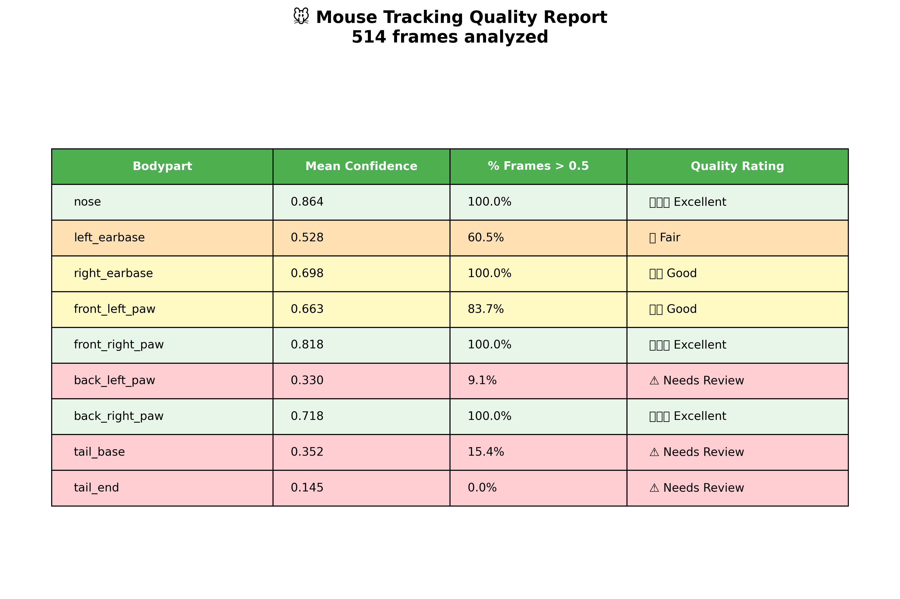
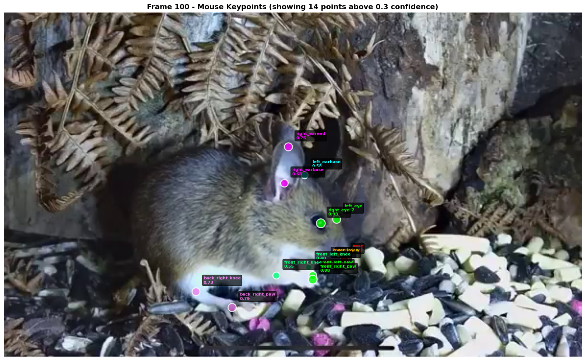

# Mouse Pose Estimation using DeepLabCut SuperAnimal

Behavioral analysis pipeline for tracking mouse movement in videos using deep learning.

---

## About The Project

This project provides a complete solution for analyzing mouse behavior in research videos. Using DeepLabCut's pre-trained SuperAnimal models, it automatically tracks 39 body keypoints across every frame of your video - without requiring any manual labeling or model training.

The entire pipeline runs in Google Colab with free GPU access, making advanced pose estimation accessible to any researcher with a web browser and mouse behavioral videos.

### What It Does

- Analyzes mouse videos using state-of-the-art deep learning models
- Tracks 39 body landmarks including head, ears, spine, tail, and all four limbs
- Generates labeled videos with keypoints and skeleton overlay
- Exports tracking data in multiple formats (HDF5, CSV)
- Calculates behavioral metrics like speed, distance traveled, and movement patterns

---

Tracked Bodyparts (39 total):

Head: nose, upper_jaw, lower_jaw, mouth_end_left, mouth_end_right, left_eye, right_eye
Ears: left_earbase, left_earend, right_earbase, right_earend
Neck & Throat: neck_base, neck_end, throat_base, throat_end
Body: back_base, back_middle, back_end, body_middle_left, body_middle_right, belly_bottom
Tail: tail_base, tail_end
Front Legs: front_left_thai, front_left_knee, front_left_paw, front_right_thai, front_right_knee, front_right_paw
Back Legs: back_left_thai, back_left_knee, back_left_paw, back_right_thai, back_right_knee, back_right_paw
Antlers: left_antler_base, left_antler_end, right_antler_base, right_antler_end

Confidence Scores:

Each keypoint comes with a likelihood score (0-1) indicating tracking quality. Typical confidence ranges:

High confidence (>0.7): Nose, ears, paws - reliably tracked
Medium confidence (0.4-0.7): Body middle, knees - generally good
Low confidence (<0.4): May need filtering or improved video quality

**Output Files:**
- HDF5 files with complete tracking data
- CSV files for easy analysis
- Labeled MP4 videos with visualizations
- Trajectory plots and behavioral metrics

---

## Quick Start

1. Open the Colab notebook from this repository
2. Upload your mouse video to Google Drive
3. Run the cells to analyze your video
4. Download labeled videos and tracking data

**Processing time:** ~2-5 minutes for a 30-second video

---

## Use Cases

Perfect for researchers studying:
- **Locomotor activity** - Open field tests, rotarod performance
- **Drug effects** - Pharmacological impact on movement
- **Disease models** - Parkinson's, Huntington's, stroke recovery
- **Genetic phenotyping** - Behavioral differences in mutants
- **Pain assessment** - Movement pattern changes
- **Circadian rhythms** - 24-hour activity monitoring

---

## What You Get

After processing your video, you receive:

1. **Labeled video** (.mp4) - Your original video with tracked keypoints overlaid
2. **Tracking data** (.h5, .csv) - X, Y coordinates and confidence scores for all 39 keypoints per frame
3. **Analysis plots** - Movement trajectories, speed graphs, quality metrics
4. **Behavioral metrics** - Distance traveled, average speed, activity patterns

---

## Acknowledgments

Built using DeepLabCut framework developed by the Mathis Lab at EPFL. SuperAnimal models enable zero-shot pose estimation across species without custom training.

---

## License

This project uses DeepLabCut (LGPL-3.0 License).

---

## Citation

If you use this pipeline in your research, please cite:

**DeepLabCut:**
> Mathis et al. (2018). DeepLabCut: markerless pose estimation of user-defined body parts with deep learning. Nature Neuroscience, 21(9), 1281-1289.

**SuperAnimal:**
> Ye et al. (2024). SuperAnimal pretrained pose estimation models for behavioral analysis. Nature Communications, 15, 6529.
